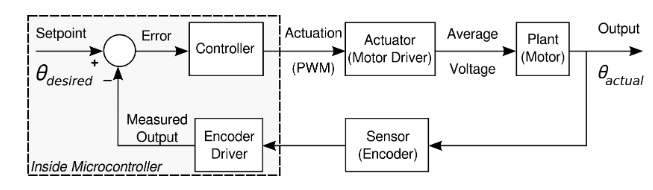
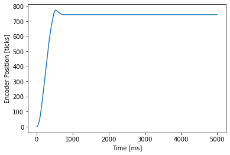
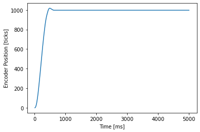
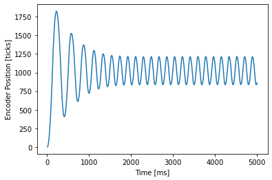

# Lab 2: Closed-loop controller for DC motor, "Out of Control"

Group: Mecha15
Sean Wahl, Nathan Dodd, Lewis Kanagy

## Overview

The files contained within this github repository are an analysis of a closed-loop motor control system and a step resposne analysis.

DC motors are used in a variety of applications across numerous engineering disciplines. There are many ways in which one could attempt to control its motion, but
a proven method to do so is through closed-loop control. Closed-loop control systems provide some of the most accurate and efficient uses of controlling an object's position.
A motor /motor driver/position sensor system can be used to operate a system and drive it at a set rate using closed-loop control. A common algorithim used is a proportional controller. 

In this proportional controller setup, many common parameters exist to control the system. The input to the system is the setpoint, or desired value of the motor (either position or velocity). 
The input to the system is then subtracted by the actual value of the system, in which the difference is calculated to be the error signal. This error signal is then multiplied by a set
K_p gain value to control how hard the controller will push the motor to match the desired and actual values. This K_p * error value is sent to the motor driver to control the speed and 
direction of the motor torque. A proportional controller system setup can be seen in Figure 2.1.

Figure 2.1. General closed loop control system 

In this exercise, the gain value of K_p is adjusted to best fit certain criteria of the assignment; K_p should not be too high so as to cause large overshoot, but not too small to not 
drive the motor efficiently. The tuning of the K_p value is done by performing step-response tests in which the input is changed from 0 to a non-zero value in order to analyze the motor
response. These motor responses, using 3 separate K_p gain values, is recorded below in Figures 2.2 - 2.4.

### Figures

Figure 2.2. Motor step response with gain value, K_p = 0.01

Figure 2.3. Motor step response with gain value, K_p = 0.015

Figure 2.4. Motor step response with gain value, K_p = 0.5
